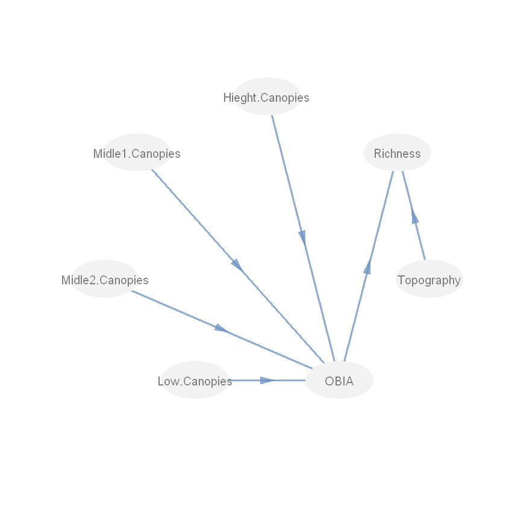
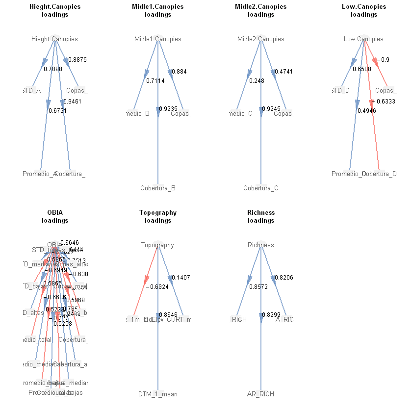
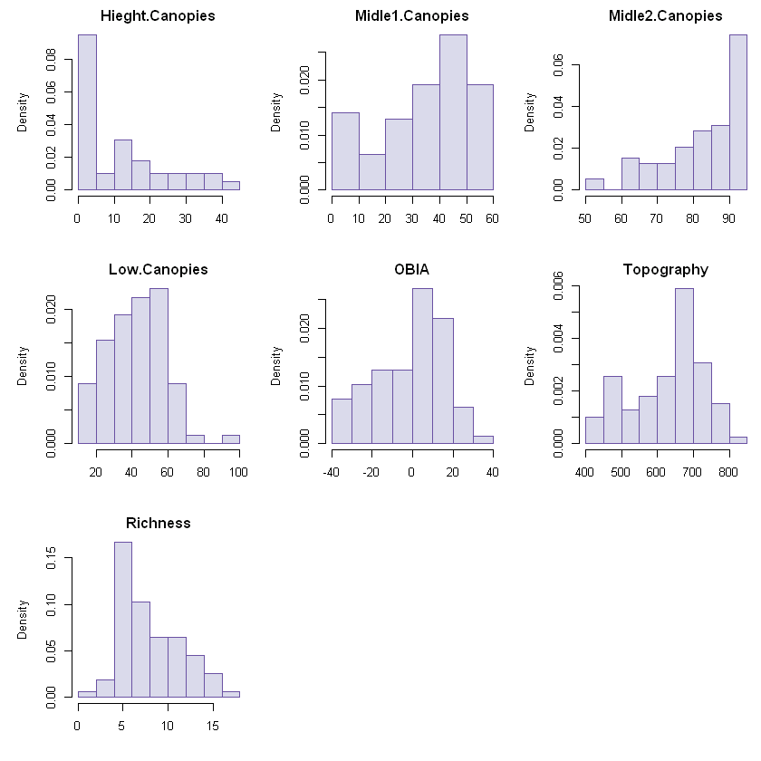
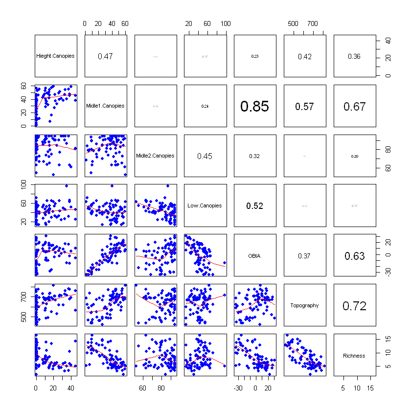
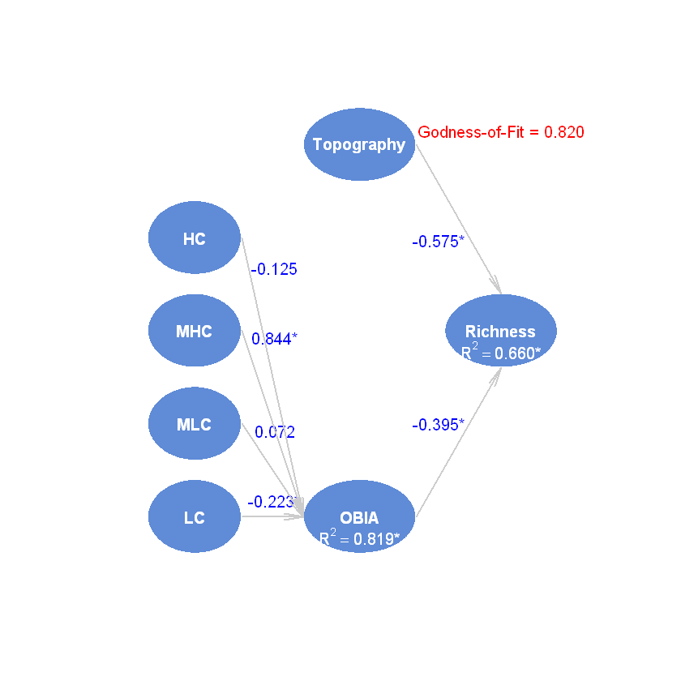

---
layout:     post
title:      "PLS Path Modelling to predict species richness using LiDAR data"
subtitle:   "Path analysis for Remote Sensing data"
date:       2016-08-29 12:00:00
author:     "Javier Lopatin"
header-img: "_posts/PLS-Path-Modelling-Tutorial-Figures/output_4_0.png"
---


<p>This is a tutorial about PLS Path Modeling applied to Geocience. The sample data is part of the analysis of [**THIS**](http://ieeexplore.ieee.org/stamp/stamp.jsp?arnumber=6990570) paper.  
See more information on PLS-PM [here](http://gastonsanchez.com/PLS_Path_Modeling_with_R.pdf).
</p>


```R
library(plspm)

## set working directory
setwd("C:/Users/Lopatin/Dropbox/Publicaciones/OBIA-PLSPM")
 
## Load data
datapls <- read.table("datapls.txt", header=T, sep="", dec=".") 
```


```R
## Set the inner model
# rows of the inner model matrix
Hieght.Canopies  = c(0, 0, 0, 0, 0, 0, 0)
Midle1.Canopies  = c(0, 0, 0, 0, 0, 0, 0)
Midle2.Canopies  = c(0, 0, 0, 0, 0, 0, 0)
Low.Canopies     = c(0, 0, 0, 0, 0, 0, 0)
OBIA             = c(1, 1, 1, 1, 0, 0, 0)
Topography       = c(0, 0, 0, 0, 0, 0, 0)
Richness         = c(0, 0, 0, 0, 1, 1, 0)
```


```R
# matrix created by row binding. Creación de las variables latentes(Agrupaciones ficticias de las variables respuesta y predictoras)
Q_inner = rbind(Hieght.Canopies, Midle1.Canopies,Midle2.Canopies, Low.Canopies, OBIA, Topography, Richness)
```


```R
# add column names (optional)
colnames(Q_inner) = rownames(Q_inner)

# plot the inner matrix
innerplot(Q_inner)
```





```R
### Set the outer model
# set the "Modes" of the relations: character vector indicating the type of measurement for each block.
Q_modes = rep("A",7)
```


```R
# define list of indicators: what variables are associated with what latent variable: 
# in the same orther than Q_inner: Hieght.Canopies, Midle1.Canopies, Midle2.Canopies, Low.Canopies, OBIA, Topography, Richness
Q_outer = list(80:83, 123:126, 166:168, 209:212, 25:40, 252:254, c(6,7,8)) 
```


```R
### Run first try!
Q_pls = plspm(datapls, Q_inner, Q_outer, Q_modes, maxiter= 1000, boot.val = F,
              br = 1000, scheme = "factor", scaled = T)
# keep the bootstrap validation "boot.val"=F in this first step to make it faster
```


```R
# Check quality of  the outer model: in the differents indices values should be over 0.7
# this is a measure of how well construct are the blocks of predictors.
Q_pls$unidim
```


<table>
<thead><tr><th></th><th scope=col>Mode</th><th scope=col>MVs</th><th scope=col>C.alpha</th><th scope=col>DG.rho</th><th scope=col>eig.1st</th><th scope=col>eig.2nd</th></tr></thead>
<tbody>
	<tr><th scope=row>Hieght.Canopies</th><td>A                </td><td>4                </td><td>0.846691847864926</td><td>0.898541284976128</td><td>2.76660593039423 </td><td>0.848970661259768</td></tr>
	<tr><th scope=row>Midle1.Canopies</th><td>A                </td><td>3                </td><td>0.832649280723446</td><td>0.902890955686392</td><td>2.27622104645669 </td><td>0.703391587881361</td></tr>
	<tr><th scope=row>Midle2.Canopies</th><td>A                </td><td>3                </td><td>0                </td><td>0.282623863915595</td><td>1.7994571554243  </td><td>1.16646325558366 </td></tr>
	<tr><th scope=row>Low.Canopies</th><td>A                </td><td>4                </td><td>0.583217363882368</td><td>0.549549877784367</td><td>1.9039716970801  </td><td>1.80619452395328 </td></tr>
	<tr><th scope=row>OBIA</th><td>A                </td><td>16               </td><td>0                </td><td>0.134346140387168</td><td>6.78169811420588 </td><td>3.03926457205021 </td></tr>
	<tr><th scope=row>Topography</th><td>A                </td><td>3                </td><td>0                </td><td>0.135732552235257</td><td>1.31878839969304 </td><td>0.917497083954768</td></tr>
	<tr><th scope=row>Richness</th><td>A                </td><td>3                </td><td>0.823262974611027</td><td>0.894912864943492</td><td>2.21931450180523 </td><td>0.495174584199028</td></tr>
</tbody>
</table>


```R
# check outer model. Loadings must be greater than 0.7, and communalites grater than 0.5:
Q_pls$outer
```


<table>
<thead><tr><th></th><th scope=col>name</th><th scope=col>block</th><th scope=col>weight</th><th scope=col>loading</th><th scope=col>communality</th><th scope=col>redundancy</th></tr></thead>
<tbody>
	<tr><th scope=row>1</th><td>Copas_A          </td><td>Hieght.Canopies  </td><td>0.35856854885461 </td><td>0.887519839594922</td><td>0.787691465674596</td><td>0                </td></tr>
	<tr><th scope=row>2</th><td>Cobertura_       </td><td>Hieght.Canopies  </td><td>0.345898960229866</td><td>0.94614604741216 </td><td>0.895192343033654</td><td>0                </td></tr>
	<tr><th scope=row>3</th><td>Promedio_A       </td><td>Hieght.Canopies  </td><td>0.270903422885627</td><td>0.672115038550411</td><td>0.451738625045621</td><td>0                </td></tr>
	<tr><th scope=row>4</th><td>STD_A            </td><td>Hieght.Canopies  </td><td>0.218305257714878</td><td>0.789784461903717</td><td>0.623759496264543</td><td>0                </td></tr>
	<tr><th scope=row>5</th><td>Copas_B          </td><td>Midle1.Canopies  </td><td>0.404997431054494</td><td>0.88395131534034 </td><td>0.781369927891918</td><td>0                </td></tr>
	<tr><th scope=row>6</th><td>Cobertura_B      </td><td>Midle1.Canopies  </td><td>0.438210882193238</td><td>0.993479294561978</td><td>0.987001108723365</td><td>0                </td></tr>
	<tr><th scope=row>7</th><td>Promedio_B       </td><td>Midle1.Canopies  </td><td>0.290485615251922</td><td>0.711389959258348</td><td>0.506075674133594</td><td>0                </td></tr>
	<tr><th scope=row>8</th><td>Copas_C          </td><td>Midle2.Canopies  </td><td>0.270958947201145</td><td>0.47408348163835 </td><td>0.22475514756234 </td><td>0                </td></tr>
	<tr><th scope=row>9</th><td>Cobertura_C      </td><td>Midle2.Canopies  </td><td>0.801763112396802</td><td>0.994483529540894</td><td>0.988997490528114</td><td>0                </td></tr>
	<tr><th scope=row>10</th><td>Promedio_C        </td><td>Midle2.Canopies   </td><td>0.299211312373236 </td><td>0.247994063022574 </td><td>0.0615010552944445</td><td>0                 </td></tr>
	<tr><th scope=row>11</th><td>Copas_D           </td><td>Low.Canopies      </td><td>0.494974793440597 </td><td>-0.899995291539908</td><td>0.809991524794004 </td><td>0                 </td></tr>
	<tr><th scope=row>12</th><td>Cobertura_D       </td><td>Low.Canopies      </td><td>0.316671472295785 </td><td>-0.633299211530968</td><td>0.401067891325746 </td><td>0                 </td></tr>
	<tr><th scope=row>13</th><td>Promedio_D        </td><td>Low.Canopies      </td><td>-0.308728520402696</td><td>0.494577822579864 </td><td>0.24460722258784  </td><td>0                 </td></tr>
	<tr><th scope=row>14</th><td>STD_D             </td><td>Low.Canopies      </td><td>-0.309271229265038</td><td>0.650842769443926 </td><td>0.423596310537439 </td><td>0                 </td></tr>
	<tr><th scope=row>15</th><td>Copas_total       </td><td>OBIA              </td><td>0.0863176644997283</td><td>0.664623343022256 </td><td>0.44172418809008  </td><td>0.376227117644485 </td></tr>
	<tr><th scope=row>16</th><td>Copas_altas      </td><td>OBIA             </td><td>0.09698718892714 </td><td>0.644419737978339</td><td>0.415276798696071</td><td>0.35370123984741 </td></tr>
	<tr><th scope=row>17</th><td>Copas_medianas   </td><td>OBIA             </td><td>0.122581200028031</td><td>0.751267044129976</td><td>0.564402171595791</td><td>0.480714907485369</td></tr>
	<tr><th scope=row>18</th><td>Copas_bajas       </td><td>OBIA              </td><td>-0.119995171869195</td><td>-0.638208075216374</td><td>0.407309547271389 </td><td>0.346915340139229 </td></tr>
	<tr><th scope=row>19</th><td>Cobertura_total    </td><td>OBIA               </td><td>-0.0131657669756342</td><td>-0.054653848646225 </td><td>0.00298704317184447</td><td>0.00254413652936187</td></tr>
	<tr><th scope=row>20</th><td>Cobertura_altas   </td><td>OBIA              </td><td>0.0889292849401984</td><td>0.596910325699595 </td><td>0.356301936926796 </td><td>0.303470931308337 </td></tr>
	<tr><th scope=row>21</th><td>Cobertua_medianas</td><td>OBIA             </td><td>0.125814729420881</td><td>0.764992398968243</td><td>0.585213370479187</td><td>0.49844030623358 </td></tr>
	<tr><th scope=row>22</th><td>Cobertura_bajas   </td><td>OBIA              </td><td>-0.150301978583175</td><td>-0.944939696940639</td><td>0.892911030854267 </td><td>0.760513805919906 </td></tr>
	<tr><th scope=row>23</th><td>Promedio_altas    </td><td>OBIA              </td><td>0.0800682487984746</td><td>0.525795325211123 </td><td>0.276460724013871 </td><td>0.235468249514186 </td></tr>
	<tr><th scope=row>24</th><td>Promedio_bajas     </td><td>OBIA               </td><td>-0.0913180299276499</td><td>-0.727023045119911 </td><td>0.528562508135427  </td><td>0.450189403914143  </td></tr>
	<tr><th scope=row>25</th><td>Promedio_medianas </td><td>OBIA              </td><td>0.0803774673359316</td><td>0.522294767578688 </td><td>0.272791824240075 </td><td>0.23234335931338  </td></tr>
	<tr><th scope=row>26</th><td>Promedio_total     </td><td>OBIA               </td><td>-0.0880800169956293</td><td>-0.668607588568929 </td><td>0.447036107491959  </td><td>0.380751407188985  </td></tr>
	<tr><th scope=row>27</th><td>STD_altas        </td><td>OBIA             </td><td>0.085509619662947</td><td>0.585501029239287</td><td>0.342811455240264</td><td>0.29198076351267 </td></tr>
	<tr><th scope=row>28</th><td>STD_bajas          </td><td>OBIA               </td><td>-0.0853530675068772</td><td>-0.6949127835221   </td><td>0.482903776702433  </td><td>0.411300763931321  </td></tr>
	<tr><th scope=row>29</th><td>STD_medianas      </td><td>OBIA              </td><td>0.0946053283582827</td><td>0.58648254767977  </td><td>0.343961778732954 </td><td>0.29296052170496  </td></tr>
	<tr><th scope=row>30</th><td>STD_total          </td><td>OBIA               </td><td>-0.0740587591672799</td><td>-0.609744395066354 </td><td>0.371788227314834  </td><td>0.31666097738865   </td></tr>
	<tr><th scope=row>31</th><td>D_Elev_CURT_mean_CUBE</td><td>Topography           </td><td>-0.00310653422277474 </td><td>0.140659883360907    </td><td>0.0197852027871039   </td><td>0                    </td></tr>
	<tr><th scope=row>32</th><td>DTM_1_mean       </td><td>Topography       </td><td>0.742779839742295</td><td>0.864597803566728</td><td>0.74752936193241 </td><td>0                </td></tr>
	<tr><th scope=row>33</th><td>slope_1m_std      </td><td>Topography        </td><td>-0.517380027867904</td><td>-0.69239461801966 </td><td>0.479410307062591 </td><td>0                 </td></tr>
	<tr><th scope=row>34</th><td>A_RICH           </td><td>Richness         </td><td>0.360473747384202</td><td>0.820645863738968</td><td>0.673459633671877</td><td>0.475106420059154</td></tr>
	<tr><th scope=row>35</th><td>AR_RICH          </td><td>Richness         </td><td>0.389306082369274</td><td>0.899932533266213</td><td>0.809878564430943</td><td>0.571346055785882</td></tr>
	<tr><th scope=row>36</th><td>H_RICH           </td><td>Richness         </td><td>0.412764595728446</td><td>0.857218630090367</td><td>0.734823779774005</td><td>0.518397061868836</td></tr>
</tbody>
</table>


```R
# plotting the loadings 
plot(Q_pls, what = "loadings")
```





```R
# Another measure of block construction is the "crossloadings". 
# This gives you the correlation of the variables with all Latent Variables.
# The idea is to find if there are any "traitor" indicators. That means that the R should be higher within his own block or LV
Q_pls$crossloading
```


<table>
<thead><tr><th></th><th scope=col>name</th><th scope=col>block</th><th scope=col>Hieght.Canopies</th><th scope=col>Midle1.Canopies</th><th scope=col>Midle2.Canopies</th><th scope=col>Low.Canopies</th><th scope=col>OBIA</th><th scope=col>Topography</th><th scope=col>Richness</th></tr></thead>
<tbody>
	<tr><th scope=row>1</th><td>Copas_A            </td><td>Hieght.Canopies    </td><td>0.887519839594922  </td><td>0.408320449896677  </td><td>-0.0409628240716801</td><td>-0.001321448147798 </td><td>0.494507103206552  </td><td>0.360346091919818  </td><td>-0.347890513463862 </td></tr>
	<tr><th scope=row>2</th><td>Cobertura_         </td><td>Hieght.Canopies    </td><td>0.94614604741216   </td><td>0.423037715082624  </td><td>-0.101613998438346 </td><td>-0.0378794248622538</td><td>0.477033100750562  </td><td>0.342332956501919  </td><td>-0.330279634319887 </td></tr>
	<tr><th scope=row>3</th><td>Promedio_A         </td><td>Hieght.Canopies    </td><td>0.672115038550411  </td><td>0.393832337911125  </td><td>-0.138767293942483 </td><td>0.00313224478289262</td><td>0.373624675506314  </td><td>0.253705955042277  </td><td>-0.298215764021587 </td></tr>
	<tr><th scope=row>4</th><td>STD_A              </td><td>Hieght.Canopies    </td><td>0.789784461903717  </td><td>0.412115437256486  </td><td>-0.0491633246154661</td><td>-0.187929206135685 </td><td>0.301076681899943  </td><td>0.301551214586249  </td><td>-0.329918023607281 </td></tr>
	<tr><th scope=row>5</th><td>Copas_B           </td><td>Midle1.Canopies   </td><td>0.44231515720977  </td><td>0.88395131534034  </td><td>0.227577955613479 </td><td>0.34410188923242  </td><td>0.807301180930434 </td><td>0.566422768045243 </td><td>-0.621058552391112</td></tr>
	<tr><th scope=row>6</th><td>Cobertura_B       </td><td>Midle1.Canopies   </td><td>0.496245643744107 </td><td>0.993479294561978 </td><td>0.13078255915272  </td><td>0.303913338979056 </td><td>0.873503647898155 </td><td>0.597532612315923 </td><td>-0.669180896970888</td></tr>
	<tr><th scope=row>7</th><td>Promedio_B         </td><td>Midle1.Canopies    </td><td>0.319464797929433  </td><td>0.711389959258348  </td><td>-0.0400846635645223</td><td>0.136653888765394  </td><td>0.579034610696536  </td><td>0.231580269142035  </td><td>-0.31461727298685  </td></tr>
	<tr><th scope=row>8</th><td>Copas_C            </td><td>Midle2.Canopies    </td><td>-0.0391035837051883</td><td>0.0189503699086996 </td><td>0.47408348163835   </td><td>0.301497459654833  </td><td>0.0694464801945686 </td><td>0.107129640558924  </td><td>-0.0896605248719219</td></tr>
	<tr><th scope=row>9</th><td>Cobertura_C       </td><td>Midle2.Canopies   </td><td>-0.110065744503097</td><td>0.125595634919676 </td><td>0.994483529540894 </td><td>0.410252405442274 </td><td>0.205493631772666 </td><td>0.210909253730165 </td><td>-0.191186016193234</td></tr>
	<tr><th scope=row>10</th><td>Promedio_C         </td><td>Midle2.Canopies    </td><td>0.00227536785069336</td><td>0.106954814516118  </td><td>0.247994063022574  </td><td>-0.0624333138782381</td><td>0.0766904792396831 </td><td>0.0790222323971254 </td><td>-0.0697021139252762</td></tr>
	<tr><th scope=row>11</th><td>Copas_D            </td><td>Low.Canopies       </td><td>0.0942380158513661 </td><td>-0.271463837217265 </td><td>-0.436003126608121 </td><td>-0.899995291539908 </td><td>-0.461549676711829 </td><td>-0.0660534819506554</td><td>0.181114549593908  </td></tr>
	<tr><th scope=row>12</th><td>Cobertura_D       </td><td>Low.Canopies      </td><td>0.180248894490902 </td><td>-0.121972742470365</td><td>-0.373195362510906</td><td>-0.633299211530968</td><td>-0.295292181783647</td><td>0.0331376423520435</td><td>0.0807982674587191</td></tr>
	<tr><th scope=row>13</th><td>Promedio_D        </td><td>Low.Canopies      </td><td>0.115156320937539 </td><td>0.239655796529623 </td><td>0.0620685521521572</td><td>0.494577822579864 </td><td>0.287869869192961 </td><td>0.156575076345464 </td><td>-0.144373541387103</td></tr>
	<tr><th scope=row>14</th><td>STD_D             </td><td>Low.Canopies      </td><td>0.0466238108255403</td><td>0.210989164735152 </td><td>0.125406787163317 </td><td>0.650842769443926 </td><td>0.288379883396059 </td><td>0.0971276299670169</td><td>-0.117487345206143</td></tr>
	<tr><th scope=row>15</th><td>Copas_total        </td><td>OBIA               </td><td>0.418654489838281  </td><td>0.570599948412338  </td><td>0.00249936354121522</td><td>0.0638728233756379 </td><td>0.664623343022256  </td><td>0.273420727459669  </td><td>-0.370237059917814 </td></tr>
	<tr><th scope=row>16</th><td>Copas_altas        </td><td>OBIA               </td><td>0.669722851969746  </td><td>0.488923917719714  </td><td>-0.0880814509557413</td><td>0.234445588081725  </td><td>0.644419737978339  </td><td>0.338824356849829  </td><td>-0.366587526305245 </td></tr>
	<tr><th scope=row>17</th><td>Copas_medianas    </td><td>OBIA              </td><td>0.204439945467969 </td><td>0.768040687243468 </td><td>0.315547663672855 </td><td>0.383511429264679 </td><td>0.751267044129976 </td><td>0.439093085883244 </td><td>-0.566285958101097</td></tr>
	<tr><th scope=row>18</th><td>Copas_bajas       </td><td>OBIA              </td><td>-0.251829412354326</td><td>-0.645077386271644</td><td>-0.29216289648397 </td><td>-0.552940013874502</td><td>-0.638208075216374</td><td>-0.44728091657966 </td><td>0.525287956465022 </td></tr>
	<tr><th scope=row>19</th><td>Cobertura_total    </td><td>OBIA               </td><td>-0.0684326495718846</td><td>-0.122368077005591 </td><td>0.0839141366958184 </td><td>0.204850605334762  </td><td>-0.054653848646225 </td><td>-0.151217229417888 </td><td>0.20461868797609   </td></tr>
	<tr><th scope=row>20</th><td>Cobertura_altas    </td><td>OBIA               </td><td>0.674623225915142  </td><td>0.413160645757102  </td><td>-0.0407044891524651</td><td>0.227970831411015  </td><td>0.596910325699595  </td><td>0.263544606881536  </td><td>-0.312206956989512 </td></tr>
	<tr><th scope=row>21</th><td>Cobertua_medianas </td><td>OBIA              </td><td>0.122574716897042 </td><td>0.77278528015989  </td><td>0.346306032651091 </td><td>0.531940867025897 </td><td>0.764992398968243 </td><td>0.447938902233057 </td><td>-0.555719363243558</td></tr>
	<tr><th scope=row>22</th><td>Cobertura_bajas   </td><td>OBIA              </td><td>-0.393401023353709</td><td>-0.869946368021502</td><td>-0.279790069486496</td><td>-0.575401488297005</td><td>-0.944939696940639</td><td>-0.500524041329783</td><td>0.62924938389248  </td></tr>
	<tr><th scope=row>23</th><td>Promedio_altas    </td><td>OBIA              </td><td>0.495576444303081 </td><td>0.435750415369993 </td><td>-0.056633471676596</td><td>0.268218906051599 </td><td>0.525795325211123 </td><td>0.165512122370488 </td><td>-0.238333430035501</td></tr>
	<tr><th scope=row>24</th><td>Promedio_bajas    </td><td>OBIA              </td><td>-0.308897797015337</td><td>-0.497437686889517</td><td>-0.115525248294272</td><td>-0.357150847430131</td><td>-0.727023045119911</td><td>-0.272260183486131</td><td>0.380985095418099 </td></tr>
	<tr><th scope=row>25</th><td>Promedio_medianas </td><td>OBIA              </td><td>0.11187326896202  </td><td>0.52329406759956  </td><td>0.140888267068203 </td><td>0.446529162698978 </td><td>0.522294767578688 </td><td>0.168618763729387 </td><td>-0.225565767169088</td></tr>
	<tr><th scope=row>26</th><td>Promedio_total     </td><td>OBIA               </td><td>-0.403351366488428 </td><td>-0.605322953007359 </td><td>0.00264075337222574</td><td>-0.041867492498994 </td><td>-0.668607588568929 </td><td>-0.294096422911735 </td><td>0.385287521851039  </td></tr>
	<tr><th scope=row>27</th><td>STD_altas         </td><td>OBIA              </td><td>0.526405964794448 </td><td>0.390404090097426 </td><td>0.0555445267982733</td><td>0.249022481101418 </td><td>0.585501029239287 </td><td>0.273247338297402 </td><td>-0.355089511493018</td></tr>
	<tr><th scope=row>28</th><td>STD_bajas         </td><td>OBIA              </td><td>-0.308031997893576</td><td>-0.474928198395805</td><td>-0.18108454438834 </td><td>-0.318840595085976</td><td>-0.6949127835221  </td><td>-0.237681127901869</td><td>0.313602392774756 </td></tr>
	<tr><th scope=row>29</th><td>STD_medianas      </td><td>OBIA              </td><td>0.0519803519735503</td><td>0.584017351772956 </td><td>0.215783146204284 </td><td>0.450088520909368 </td><td>0.58648254767977  </td><td>0.382314148193159 </td><td>-0.421206260276992</td></tr>
	<tr><th scope=row>30</th><td>STD_total          </td><td>OBIA               </td><td>-0.389119887204589 </td><td>-0.519990787490637 </td><td>-0.0335453800687905</td><td>-0.036062574831826 </td><td>-0.609744395066354 </td><td>-0.174096769493999 </td><td>0.25430336825763   </td></tr>
	<tr><th scope=row>31</th><td>D_Elev_CURT_mean_CUBE</td><td>Topography           </td><td>0.181642527970136    </td><td>-0.0713392941962084  </td><td>-0.263876380461053   </td><td>-0.539584285825315   </td><td>-0.230090624349551   </td><td>0.140659883360907    </td><td>0.00303274596208409  </td></tr>
	<tr><th scope=row>32</th><td>DTM_1_mean        </td><td>Topography        </td><td>0.418207714058263 </td><td>0.526559007350189 </td><td>0.0973858667547401</td><td>-0.117150170454601</td><td>0.414531922522527 </td><td>0.864597803566728 </td><td>-0.72485744974804 </td></tr>
	<tr><th scope=row>33</th><td>slope_1m_std      </td><td>Topography        </td><td>-0.139374216691116</td><td>-0.323121794493812</td><td>-0.287245994575352</td><td>-0.359348203509761</td><td>-0.353007346607618</td><td>-0.69239461801966 </td><td>0.504902407430393 </td></tr>
	<tr><th scope=row>34</th><td>A_RICH              </td><td>Richness            </td><td>-0.383821946440711  </td><td>-0.485975638771359  </td><td>-0.127825920158167  </td><td>-0.00465549196735269</td><td>-0.417731485569692  </td><td>-0.695113461830622  </td><td>0.820645863738968   </td></tr>
	<tr><th scope=row>35</th><td>AR_RICH           </td><td>Richness          </td><td>-0.296442749217605</td><td>-0.618192027540917</td><td>-0.264849837923748</td><td>-0.246563567934039</td><td>-0.582398995535272</td><td>-0.649503215914659</td><td>0.899932533266213 </td></tr>
	<tr><th scope=row>36</th><td>H_RICH            </td><td>Richness          </td><td>-0.334408013166875</td><td>-0.533751895909919</td><td>-0.119318219238266</td><td>-0.238572906393757</td><td>-0.579879091424347</td><td>-0.717647878389006</td><td>0.857218630090367 </td></tr>
</tbody>
</table>


```R
# now you can eliminate all variables with loading below 0.7
# Also, internally is not possible to have negative loading. 
# The proposed solution is to invert the scale of the ill-fated manifest variables:
datapls$NCobertura_bajas = -1 * datapls$Cobertura_bajas # new variable N° 255
datapls$Nslope_1m_std    = -1 * datapls$slope_1m_std    # new variable N° 256
```


```R
### Run second try!
# set again the list of indicators with the selected and inverted variables

# (80:83, 123:126, 166:168, 209:212, 25:40, 251:253, c(6,7,8))

Q_outer = list (c(80,81,83), c(123,124), c(167), c(209,210), c(27,31,255), c(252, 256), c(6,7,8))
```


```R
# run PLSPM
Q_pls = plspm(datapls, Q_inner, Q_outer, Q_modes, maxiter= 1000, boot.val = T, 
              br = 1000, scheme = "factor", scaled = T)
summary(Q_pls)
# check again for the indicators of model quality. This time use bootstrap validation. 
# With summary yo have all information
```


    PARTIAL LEAST SQUARES PATH MODELING (PLS-PM) 
    
    ---------------------------------------------------------- 
    MODEL SPECIFICATION 
    1   Number of Cases      78 
    2   Latent Variables     7 
    3   Manifest Variables   16 
    4   Scale of Data        Standardized Data 
    5   Non-Metric PLS       FALSE 
    6   Weighting Scheme     factorial 
    7   Tolerance Crit       1e-06 
    8   Max Num Iters        1000 
    9   Convergence Iters    4 
    10  Bootstrapping        TRUE 
    11  Bootstrap samples    1000 
    
    ---------------------------------------------------------- 
    BLOCKS DEFINITION 
                  Block         Type   Size   Mode
    1   Hieght.Canopies    Exogenous      3      A
    2   Midle1.Canopies    Exogenous      2      A
    3   Midle2.Canopies    Exogenous      1      A
    4      Low.Canopies    Exogenous      2      A
    5              OBIA   Endogenous      3      A
    6        Topography    Exogenous      2      A
    7          Richness   Endogenous      3      A
    
    ---------------------------------------------------------- 
    BLOCKS UNIDIMENSIONALITY 
                     Mode  MVs  C.alpha  DG.rho  eig.1st  eig.2nd
    Hieght.Canopies     A    3    0.876   0.926     2.42    0.537
    Midle1.Canopies     A    2    0.940   0.971     1.89    0.112
    Midle2.Canopies     A    1    1.000   1.000     1.00    0.000
    Low.Canopies        A    2    0.933   0.968     1.88    0.125
    OBIA                A    3    0.948   0.966     2.72    0.193
    Topography          A    2    0.382   0.764     1.24    0.764
    Richness            A    3    0.823   0.895     2.22    0.495
    
    ---------------------------------------------------------- 
    OUTER MODEL 
                           weight  loading  communality  redundancy
    Hieght.Canopies                                                
      1 Copas_A             0.376    0.918        0.842       0.000
      1 Cobertura_          0.351    0.955        0.913       0.000
      1 STD_A               0.393    0.812        0.660       0.000
    Midle1.Canopies                                                
      2 Copas_B             0.504    0.970        0.941       0.000
      2 Cobertura_B         0.526    0.973        0.946       0.000
    Midle2.Canopies                                                
      3 Cobertura_C         1.000    1.000        1.000       0.000
    Low.Canopies                                                   
      4 Copas_D             0.602    0.978        0.957       0.000
      4 Cobertura_D         0.430    0.957        0.915       0.000
    OBIA                                                           
      5 Copas_medianas      0.331    0.933        0.870       0.713
      5 Cobertua_medianas   0.338    0.968        0.936       0.767
      5 NCobertura_bajas    0.382    0.954        0.910       0.745
    Topography                                                     
      6 DTM_1_mean          0.742    0.864        0.747       0.000
      6 Nslope_1m_std       0.518    0.693        0.480       0.000
    Richness                                                       
      7 A_RICH              0.352    0.817        0.667       0.471
      7 AR_RICH             0.396    0.902        0.813       0.574
      7 H_RICH              0.414    0.859        0.737       0.520
    
    ---------------------------------------------------------- 
    CROSSLOADINGS 
                           Hieght.Canopies  Midle1.Canopies  Midle2.Canopies
    Hieght.Canopies                                                         
      1 Copas_A                     0.9178            0.422          -0.0481
      1 Cobertura_                  0.9554            0.418          -0.1120
      1 STD_A                       0.8124            0.393          -0.0626
    Midle1.Canopies                                                         
      2 Copas_B                     0.4259            0.970           0.2117
      2 Cobertura_B                 0.4673            0.973           0.1193
    Midle2.Canopies                                                         
      3 Cobertura_C                -0.0820            0.169           1.0000
    Low.Canopies                                                            
      4 Copas_D                     0.1250           -0.294          -0.4566
      4 Cobertura_D                 0.2010           -0.131          -0.3903
    OBIA                                                                    
      5 Copas_medianas              0.1707            0.781           0.3128
      5 Cobertua_medianas           0.0867            0.774           0.3398
      5 NCobertura_bajas            0.3545            0.866           0.2767
    Topography                                                              
      6 DTM_1_mean                  0.4257            0.562           0.0779
      6 Nslope_1m_std               0.1133            0.352           0.2941
    Richness                                                                
      7 A_RICH                     -0.3679           -0.504          -0.1191
      7 AR_RICH                    -0.2806           -0.639          -0.2569
      7 H_RICH                     -0.3263           -0.567          -0.1169
                           Low.Canopies    OBIA  Topography  Richness
    Hieght.Canopies                                                  
      1 Copas_A                  0.0678   0.199      0.3604   -0.3473
      1 Cobertura_               0.1177   0.185      0.3425   -0.3293
      1 STD_A                    0.2413   0.207      0.3021   -0.3291
    Midle1.Canopies                                                  
      2 Copas_B                 -0.2497   0.808      0.5660   -0.6218
      2 Cobertura_B             -0.2039   0.844      0.5970   -0.6697
    Midle2.Canopies                                                  
      3 Cobertura_C             -0.4426   0.324      0.2101   -0.1921
    Low.Canopies                                                     
      4 Copas_D                  0.9781  -0.519     -0.0641    0.1827
      4 Cobertura_D              0.9567  -0.371      0.0355    0.0816
    OBIA                                                             
      5 Copas_medianas          -0.3624   0.933      0.4384   -0.5673
      5 Cobertua_medianas       -0.4719   0.968      0.4471   -0.5574
      5 NCobertura_bajas        -0.5039   0.954      0.4995   -0.6307
    Topography                                                       
      6 DTM_1_mean               0.1323   0.380      0.8642   -0.7237
      6 Nslope_1m_std           -0.2347   0.395      0.6929   -0.5050
    Richness                                                         
      7 A_RICH                   0.0238  -0.385     -0.6949    0.8169
      7 AR_RICH                  0.1955  -0.607     -0.6489    0.9019
      7 H_RICH                   0.1431  -0.582     -0.7175    0.8585
    
    ---------------------------------------------------------- 
    INNER MODEL 
    $OBIA
                       Estimate   Std. Error     t value   Pr(>|t|)
    Intercept          8.04e-17       0.0498    1.61e-15   1.00e+00
    Hieght.Canopies   -1.25e-01       0.0591   -2.12e+00   3.76e-02
    Midle1.Canopies    8.44e-01       0.0602    1.40e+01   2.04e-22
    Midle2.Canopies    7.20e-02       0.0558    1.29e+00   2.01e-01
    Low.Canopies      -2.23e-01       0.0585   -3.81e+00   2.83e-04
    
    $Richness
                  Estimate   Std. Error     t value   Pr(>|t|)
    Intercept    -2.08e-16       0.0626   -3.32e-15   1.00e+00
    OBIA         -2.99e-01       0.0717   -4.17e+00   8.06e-05
    Topography   -6.53e-01       0.0717   -9.10e+00   9.53e-14
    
    ---------------------------------------------------------- 
    CORRELATIONS BETWEEN LVs 
                     Hieght.Canopies  Midle1.Canopies  Midle2.Canopies
    Hieght.Canopies            1.000            0.460           -0.082
    Midle1.Canopies            0.460            1.000            0.169
    Midle2.Canopies           -0.082            0.169            1.000
    Low.Canopies               0.162           -0.233           -0.443
    OBIA                       0.221            0.851            0.324
    Topography                 0.375            0.599            0.210
    Richness                  -0.376           -0.665           -0.192
                     Low.Canopies    OBIA  Topography  Richness
    Hieght.Canopies        0.1616   0.221      0.3746    -0.376
    Midle1.Canopies       -0.2330   0.851      0.5989    -0.665
    Midle2.Canopies       -0.4426   0.324      0.2101    -0.192
    Low.Canopies           1.0000  -0.472     -0.0233     0.145
    OBIA                  -0.4719   1.000      0.4870    -0.617
    Topography            -0.0233   0.487      1.0000    -0.798
    Richness               0.1450  -0.617     -0.7984     1.000
    
    ---------------------------------------------------------- 
    SUMMARY INNER MODEL 
                           Type     R2  Block_Communality  Mean_Redundancy    AVE
    Hieght.Canopies   Exogenous  0.000              0.805            0.000  0.805
    Midle1.Canopies   Exogenous  0.000              0.944            0.000  0.944
    Midle2.Canopies   Exogenous  0.000              1.000            0.000  1.000
    Low.Canopies      Exogenous  0.000              0.936            0.000  0.936
    OBIA             Endogenous  0.819              0.905            0.742  0.905
    Topography        Exogenous  0.000              0.614            0.000  0.614
    Richness         Endogenous  0.706              0.739            0.522  0.739
    
    ---------------------------------------------------------- 
    GOODNESS-OF-FIT 
    [1]  0.7918
    
    ---------------------------------------------------------- 
    TOTAL EFFECTS 
                             relationships  direct  indirect    total
    1   Hieght.Canopies -> Midle1.Canopies   0.000    0.0000   0.0000
    2   Hieght.Canopies -> Midle2.Canopies   0.000    0.0000   0.0000
    3      Hieght.Canopies -> Low.Canopies   0.000    0.0000   0.0000
    4              Hieght.Canopies -> OBIA  -0.125    0.0000  -0.1252
    5        Hieght.Canopies -> Topography   0.000    0.0000   0.0000
    6          Hieght.Canopies -> Richness   0.000    0.0374   0.0374
    7   Midle1.Canopies -> Midle2.Canopies   0.000    0.0000   0.0000
    8      Midle1.Canopies -> Low.Canopies   0.000    0.0000   0.0000
    9              Midle1.Canopies -> OBIA   0.844    0.0000   0.8441
    10       Midle1.Canopies -> Topography   0.000    0.0000   0.0000
    11         Midle1.Canopies -> Richness   0.000   -0.2525  -0.2525
    12     Midle2.Canopies -> Low.Canopies   0.000    0.0000   0.0000
    13             Midle2.Canopies -> OBIA   0.072    0.0000   0.0720
    14       Midle2.Canopies -> Topography   0.000    0.0000   0.0000
    15         Midle2.Canopies -> Richness   0.000   -0.0216  -0.0216
    16                Low.Canopies -> OBIA  -0.223    0.0000  -0.2231
    17          Low.Canopies -> Topography   0.000    0.0000   0.0000
    18            Low.Canopies -> Richness   0.000    0.0667   0.0667
    19                  OBIA -> Topography   0.000    0.0000   0.0000
    20                    OBIA -> Richness  -0.299    0.0000  -0.2991
    21              Topography -> Richness  -0.653    0.0000  -0.6528
    
    --------------------------------------------------------- 
    BOOTSTRAP VALIDATION 
    weights 
                                 Original  Mean.Boot  Std.Error  perc.025  perc.975
    Hieght.Canopies-Copas_A         0.376      0.366   1.19e-01     0.250     0.492
    Hieght.Canopies-Cobertura_      0.351      0.346   1.14e-01     0.174     0.451
    Hieght.Canopies-STD_A           0.393      0.390   1.62e-01     0.184     0.637
    Midle1.Canopies-Copas_B         0.504      0.504   1.03e-02     0.487     0.526
    Midle1.Canopies-Cobertura_B     0.526      0.526   1.09e-02     0.506     0.548
    Midle2.Canopies-Cobertura_C     1.000      1.000   1.20e-16     1.000     1.000
    Low.Canopies-Copas_D            0.602      0.604   3.70e-02     0.546     0.689
    Low.Canopies-Cobertura_D        0.430      0.428   3.61e-02     0.349     0.486
    OBIA-Copas_medianas             0.331      0.331   9.14e-03     0.312     0.348
    OBIA-Cobertua_medianas          0.338      0.338   9.24e-03     0.318     0.354
    OBIA-NCobertura_bajas           0.382      0.383   1.60e-02     0.357     0.418
    Topography-DTM_1_mean           0.742      0.740   6.92e-02     0.617     0.890
    Topography-Nslope_1m_std        0.518      0.515   5.75e-02     0.392     0.615
    Richness-A_RICH                 0.352      0.352   2.30e-02     0.304     0.395
    Richness-AR_RICH                0.396      0.395   2.36e-02     0.353     0.441
    Richness-H_RICH                 0.414      0.414   2.65e-02     0.367     0.470
    
    loadings 
                                 Original  Mean.Boot  Std.Error  perc.025  perc.975
    Hieght.Canopies-Copas_A         0.918      0.912   7.04e-02     0.795     0.967
    Hieght.Canopies-Cobertura_      0.955      0.945   7.12e-02     0.869     0.983
    Hieght.Canopies-STD_A           0.812      0.804   1.30e-01     0.626     0.932
    Midle1.Canopies-Copas_B         0.970      0.970   7.01e-03     0.954     0.981
    Midle1.Canopies-Cobertura_B     0.973      0.972   6.27e-03     0.957     0.982
    Midle2.Canopies-Cobertura_C     1.000      1.000   1.11e-16     1.000     1.000
    Low.Canopies-Copas_D            0.978      0.978   5.49e-03     0.966     0.986
    Low.Canopies-Cobertura_D        0.957      0.955   1.29e-02     0.923     0.974
    OBIA-Copas_medianas             0.933      0.932   1.64e-02     0.895     0.959
    OBIA-Cobertua_medianas          0.968      0.967   1.02e-02     0.943     0.982
    OBIA-NCobertura_bajas           0.954      0.953   1.26e-02     0.923     0.974
    Topography-DTM_1_mean           0.864      0.866   3.15e-02     0.799     0.924
    Topography-Nslope_1m_std        0.693      0.688   9.28e-02     0.463     0.827
    Richness-A_RICH                 0.817      0.815   5.07e-02     0.695     0.891
    Richness-AR_RICH                0.902      0.900   2.25e-02     0.850     0.936
    Richness-H_RICH                 0.859      0.860   2.75e-02     0.802     0.906
    
    paths 
                             Original  Mean.Boot  Std.Error  perc.025  perc.975
    Hieght.Canopies -> OBIA    -0.125    -0.1190     0.0643   -0.2433   0.00849
    Midle1.Canopies -> OBIA     0.844     0.8427     0.0553    0.7259   0.94304
    Midle2.Canopies -> OBIA     0.072     0.0682     0.0529   -0.0351   0.16968
    Low.Canopies -> OBIA       -0.223    -0.2274     0.0616   -0.3554  -0.10893
    OBIA -> Richness           -0.299    -0.3011     0.0696   -0.4369  -0.16835
    Topography -> Richness     -0.653    -0.6548     0.0599   -0.7607  -0.53075
    
    rsq 
              Original  Mean.Boot  Std.Error  perc.025  perc.975
    OBIA         0.819      0.824     0.0323     0.755     0.880
    Richness     0.706      0.716     0.0450     0.615     0.795
    
    total.efs 
                                        Original  Mean.Boot  Std.Error  perc.025
    Hieght.Canopies -> Midle1.Canopies    0.0000     0.0000     0.0000   0.00000
    Hieght.Canopies -> Midle2.Canopies    0.0000     0.0000     0.0000   0.00000
    Hieght.Canopies -> Low.Canopies       0.0000     0.0000     0.0000   0.00000
    Hieght.Canopies -> OBIA              -0.1252    -0.1190     0.0643  -0.24331
    Hieght.Canopies -> Topography         0.0000     0.0000     0.0000   0.00000
    Hieght.Canopies -> Richness           0.0374     0.0353     0.0208  -0.00263
    Midle1.Canopies -> Midle2.Canopies    0.0000     0.0000     0.0000   0.00000
    Midle1.Canopies -> Low.Canopies       0.0000     0.0000     0.0000   0.00000
    Midle1.Canopies -> OBIA               0.8441     0.8427     0.0553   0.72590
    Midle1.Canopies -> Topography         0.0000     0.0000     0.0000   0.00000
    Midle1.Canopies -> Richness          -0.2525    -0.2531     0.0583  -0.37365
    Midle2.Canopies -> Low.Canopies       0.0000     0.0000     0.0000   0.00000
    Midle2.Canopies -> OBIA               0.0720     0.0682     0.0529  -0.03514
    Midle2.Canopies -> Topography         0.0000     0.0000     0.0000   0.00000
    Midle2.Canopies -> Richness          -0.0216    -0.0209     0.0177  -0.05907
    Low.Canopies -> OBIA                 -0.2231    -0.2274     0.0616  -0.35542
    Low.Canopies -> Topography            0.0000     0.0000     0.0000   0.00000
    Low.Canopies -> Richness              0.0667     0.0690     0.0264   0.02528
    OBIA -> Topography                    0.0000     0.0000     0.0000   0.00000
    OBIA -> Richness                     -0.2991    -0.3011     0.0696  -0.43686
    Topography -> Richness               -0.6528    -0.6548     0.0599  -0.76072
                                        perc.975
    Hieght.Canopies -> Midle1.Canopies   0.00000
    Hieght.Canopies -> Midle2.Canopies   0.00000
    Hieght.Canopies -> Low.Canopies      0.00000
    Hieght.Canopies -> OBIA              0.00849
    Hieght.Canopies -> Topography        0.00000
    Hieght.Canopies -> Richness          0.08002
    Midle1.Canopies -> Midle2.Canopies   0.00000
    Midle1.Canopies -> Low.Canopies      0.00000
    Midle1.Canopies -> OBIA              0.94304
    Midle1.Canopies -> Topography        0.00000
    Midle1.Canopies -> Richness         -0.14114
    Midle2.Canopies -> Low.Canopies      0.00000
    Midle2.Canopies -> OBIA              0.16968
    Midle2.Canopies -> Topography        0.00000
    Midle2.Canopies -> Richness          0.00993
    Low.Canopies -> OBIA                -0.10893
    Low.Canopies -> Topography           0.00000
    Low.Canopies -> Richness             0.12477
    OBIA -> Topography                   0.00000
    OBIA -> Richness                    -0.16835
    Topography -> Richness              -0.53075
    


```R
# repeat the steps again until you are happy with your model
```


```R
# rescaling scores. So the LV have the same scale than the manifest variables

Scores = rescale(Q_pls)

op = par(mfrow = c(3, 3), mar = c(4, 5, 2, 0.5))
# for each score
for (j in 1:7) {
  # histogram (with probability density)
  hist(Scores[, j], freq = FALSE, xlab = "", border = "#6A51A3",
       col = "#DADAEB", main = colnames(Scores)[j])
  # add axes
  axis(side = 1, col = "black", col.axis = "black")
  axis(side = 2, col = "black", col.axis = "black")
}
par(op)
```





```R
# Pairs plot
panel.cor <- function(x, y, digits=2, prefix="", cex.cor, ...)
{
  usr <- par("usr"); on.exit(par(usr))
  par(usr = c(0, 1, 0, 1))
  r <- abs(cor(x, y))
  txt <- format(c(r, 0.123456789), digits=digits)[1]
  txt <- paste(prefix, txt, sep="")
  if(missing(cex.cor)) cex.cor <- 0.8/strwidth(txt)
  text(0.5, 0.5, txt, cex = cex.cor * r)
}
pairs(Scores, pch = 16, col = "blue", panel=panel.smooth, upper.panel=panel.cor)
```





```R
### Predict Richness!
# simulate the PLS-PM interactions. All variables are linear relationships. 
# See: Lopatin, J., Galleguillos, M., Fassnacht, F. E., Ceballos, A., & Hernández, J. (2015). Using a Multistructural Object-Based LiDAR Approach to Estimate Vascular Plant Richness in Mediterranean Forests With Complex Structure. IEEE Geoscience and Remote Sensing Letters, 12(5), 1008–1012.
# Create the outer model
```


```R
Q_pls$outer

```


<table>
<thead><tr><th></th><th scope=col>name</th><th scope=col>block</th><th scope=col>weight</th><th scope=col>loading</th><th scope=col>communality</th><th scope=col>redundancy</th></tr></thead>
<tbody>
	<tr><th scope=row>1</th><td>Copas_A          </td><td>Hieght.Canopies  </td><td>0.37634990403535 </td><td>0.917820976444404</td><td>0.842395344801359</td><td>0                </td></tr>
	<tr><th scope=row>2</th><td>Cobertura_       </td><td>Hieght.Canopies  </td><td>0.35103953492534 </td><td>0.955351016824881</td><td>0.912695565348334</td><td>0                </td></tr>
	<tr><th scope=row>3</th><td>STD_A            </td><td>Hieght.Canopies  </td><td>0.392932520618612</td><td>0.812384239549093</td><td>0.659968152667759</td><td>0                </td></tr>
	<tr><th scope=row>4</th><td>Copas_B          </td><td>Midle1.Canopies  </td><td>0.503713171691664</td><td>0.970234273938974</td><td>0.941354546325888</td><td>0                </td></tr>
	<tr><th scope=row>5</th><td>Cobertura_B      </td><td>Midle1.Canopies  </td><td>0.525630471449437</td><td>0.972698966976506</td><td>0.946143280357161</td><td>0                </td></tr>
	<tr><th scope=row>6</th><td>Cobertura_C    </td><td>Midle2.Canopies</td><td>1              </td><td>1              </td><td>1              </td><td>0              </td></tr>
	<tr><th scope=row>7</th><td>Copas_D          </td><td>Low.Canopies     </td><td>0.60185531855791 </td><td>0.978149366725888</td><td>0.956776183626256</td><td>0                </td></tr>
	<tr><th scope=row>8</th><td>Cobertura_D      </td><td>Low.Canopies     </td><td>0.429908161193049</td><td>0.956705730243817</td><td>0.915285854281355</td><td>0                </td></tr>
	<tr><th scope=row>9</th><td>Copas_medianas   </td><td>OBIA             </td><td>0.330507433325953</td><td>0.932925548489642</td><td>0.8703500790247  </td><td>0.712839213617221</td></tr>
	<tr><th scope=row>10</th><td>Cobertua_medianas</td><td>OBIA             </td><td>0.337925386946606</td><td>0.9675955494434  </td><td>0.936241147302676</td><td>0.766805701847227</td></tr>
	<tr><th scope=row>11</th><td>NCobertura_bajas </td><td>OBIA             </td><td>0.382349514091484</td><td>0.953802888693482</td><td>0.909739950480032</td><td>0.745100536582994</td></tr>
	<tr><th scope=row>12</th><td>DTM_1_mean       </td><td>Topography       </td><td>0.741980798027876</td><td>0.864228113044474</td><td>0.746890231376413</td><td>0                </td></tr>
	<tr><th scope=row>13</th><td>Nslope_1m_std    </td><td>Topography       </td><td>0.517739485313178</td><td>0.692934082066627</td><td>0.48015764208952 </td><td>0                </td></tr>
	<tr><th scope=row>14</th><td>A_RICH           </td><td>Richness         </td><td>0.351741351753449</td><td>0.816923421172053</td><td>0.667363876059451</td><td>0.470987222683498</td></tr>
	<tr><th scope=row>15</th><td>AR_RICH          </td><td>Richness         </td><td>0.396245008231569</td><td>0.901938416045949</td><td>0.813492906339475</td><td>0.574116727581798</td></tr>
	<tr><th scope=row>16</th><td>H_RICH           </td><td>Richness         </td><td>0.413811873088714</td><td>0.85851972737194 </td><td>0.73705612228679 </td><td>0.520172020768471</td></tr>
</tbody>
</table>


```R
O.Hieght.Canopies<-((datapls$Copas_A*Q_pls$outer$weight[1])+(datapls$Cobertura_*Q_pls$outer$weight[2])+(datapls$STD_A*Q_pls$outer$weight[3]))
O.Midle1.Canopies<-((datapls$Copas_B*Q_pls$outer$weight[4])+(datapls$Cobertura_B*Q_pls$outer$weight[5]))
O.Midle2.Canopies<-(datapls$Cobertura_C*Q_pls$outer$weight[6])
O.Low.Canopies<-((datapls$Copas_D*Q_pls$outer$weight[7])+(datapls$Cobertura_D*Q_pls$outer$weight[8]))
OBIA<-((datapls$Copas_medianas*Q_pls$outer$weight[9])+(datapls$Cobertua_medianas*Q_pls$outer$weight[10])+(datapls$NCobertura_bajas*Q_pls$outer$weight[11]))
Topography<-((datapls$DTM_1_mean*Q_pls$outer$weight[12])+(datapls$Nslope_1m_std*Q_pls$outer$weight[13]))
Rich<-((datapls$A_RICH*Q_pls$outer$weight[14])+(datapls$AR_RICH*Q_pls$outer$weight[15])+(datapls$H_RICH*Q_pls$outer$weight[16]))
#n.Rich<-Rich*1.73
summary(Rich)
```


       Min. 1st Qu.  Median    Mean 3rd Qu.    Max. 
      2.217   6.128   8.436   9.226  12.130  19.120 


```R
# Normalize the data
norm.HC <- (O.Hieght.Canopies-mean(O.Hieght.Canopies))/sd(O.Hieght.Canopies)
norm.MC1 <-(O.Midle1.Canopies-mean(O.Midle1.Canopies))/sd(O.Midle1.Canopies)
norm.MC2 <-(O.Midle2.Canopies-mean(O.Midle2.Canopies))/sd(O.Midle2.Canopies)
norm.LC<-(O.Low.Canopies-mean(O.Low.Canopies))/sd(O.Low.Canopies)
norm.Topo<-(Topography-mean(Topography))/sd(Topography)
norm.OBIA<-(OBIA-mean(OBIA))/sd(OBIA)
```


```R
# Create the inner model
OBIA2<-(norm.HC*Q_pls$path_coefs[5]+norm.MC1*Q_pls$path_coefs[12]+norm.MC2*Q_pls$path_coefs[19]+norm.LC*Q_pls$path_coefs[26])
# predict Richness
Observed <- Rich
Predicted<- ((OBIA2*Q_pls$path_coefs[35]+norm.Topo*Q_pls$path_coefs[42])*sd(Observed)) + mean(Observed)

cor(Predicted, Observed)
```


0.789104199388178


```R
summary(Observed)
summary(Predicted)
```


       Min. 1st Qu.  Median    Mean 3rd Qu.    Max. 
      2.217   6.128   8.436   9.226  12.130  19.120 


       Min. 1st Qu.  Median    Mean 3rd Qu.    Max. 
      3.627   6.576   8.279   9.226  11.770  16.280 


```R
par(mar=c(5, 5, 3, 3))
Mytitle = ""
MyXlab <- expression(paste("Observed richness (N° spp)"))
MyYlab <- expression(paste("Predicted richness (N° spp)"))
plot(Observed,Predicted,xlim=c(0,20), ylim=c(0,20),
     xlab = MyXlab, ylab = MyYlab, pch=16, pty="s", cex=1.5, cex.lab=1.5, cex.axis=1.5, main = Mytitle, las= 1)
abline(0, 1, lty=2)

R2 <- (cor(Predicted, Observed, method="pearson"))^2
RMSE <- sqrt(mean((Observed-Predicted)^2))

lm1 = lm(Predicted ~ Observed-1)
abline(lm1, lty=2, lwd=2)

txt1 = paste("r^2 =", round(R2,2))
txt2 = paste("RMSE =",round(RMSE,2), "")
txt = paste(txt1, txt2, sep="\n") 
pusr = par()$usr
text(x=pusr[1]+0.02*(pusr[2]-pusr[1]), y=pusr[4]-0.02*(pusr[4]-pusr[3]), txt, adj=c(0,1), cex=1.5)


```


```R

```


```R
library(pathdiagram)

## open plot window
wall(xlim = c(-0.1, 1), ylim = c(0, 1))

LV1 = latent("Topography", x=0.45, y=0.90, rx=0.12, ry=0.08, cex=1)
text(0.62,0.66,"-0.575*", pos=3, cex=1, col="blue")

LV3 = latent("OBIA", x=0.45, y=0.10, rx=0.12, ry=0.08,  cex= 1)
text(0.62,0.3,"-0.395*", cex=1, col="blue")

LV3.1= latent("HC", x=0.1, y=0.7, rx=0.1, ry=0.08, cex=1) 
LV3.2= latent("MHC", x=0.1, y=0.5, rx=0.1, ry=0.08, cex=1) 
LV3.3= latent("MLC", x=0.1, y=0.3, rx=0.1, ry=0.08, cex=1) 
LV3.4= latent("LC",  x=0.1, y=0.1, rx=0.1, ry=0.08, cex=1) 
text(0.27,0.6,"-0.125", cex=1, pos=3, col="blue")
text(0.27,0.45,"0.844*", cex=1, pos=3, col="blue")
text(0.27,0.25,"0.072", cex=1, pos=3, col="blue")
text(0.27,0.1,"-0.223*", cex=1, pos=3, col="blue")

LV4 = latent("Richness", x=0.75, y=0.5, rx=0.12, ry=0.08, cex=1)          

draw(LV1)
draw(LV3)
draw(LV3.1)
draw(LV3.2)
draw(LV3.3)
draw(LV3.4)
draw(LV4)

## Arrows of the inner model
arrow(from =LV1 , to = LV4, start = "east", end = "north", lwd = 2, col = "gray80", length=0.2)
arrow(from =LV3 , to = LV4, start = "east", end = "south", lwd = 2, col = "gray80", length=0.2)

arrow(from =LV3.1 , to = LV3, start = "east", end = "west", lwd = 2, col = "gray80", length=0.2)
arrow(from =LV3.2 , to = LV3, start = "east", end = "west", lwd = 2, col = "gray80", length=0.2)
arrow(from =LV3.3 , to = LV3, start = "east", end = "west", lwd = 2, col = "gray80", length=0.2)
arrow(from =LV3.4 , to = LV3, start = "east", end = "west", lwd = 2, col = "gray80", length=0.2)

## TEXT R2 
text(0.75,0.46,substitute(R^2 == "0.660*"), col="white", cex=1)
text(0.75,0.93, "Godness-of-Fit = 0.820", cex=1, col="red")
text(0.45,0.06,substitute(R^2 == "0.819*"), col="white", cex=1)
```




